# 수심달(수학에 심장을 달다) 정부과제 제안서

## 핵심 기능 요약

| 번호 | 기능명 | 핵심 내용 |
|------|--------|-----------|
| 1 | **문제 풀이 과정 인식 및 피드백 제공 AI** | 사용자 필기 인식으로 오류 검증 및 피드백 제공 |
| 2 | **학습 성향 분석 및 성취도 예측 AI** | TIPS R&D로 내부 연구개발 진행 중 |
| 3 | **LLM ChatBot** | 학습자 자연어 인식으로 맞춤형 지원 제공 |
| 4 | **'다음 학습' 예측 추천 AI** | 이전 학습 데이터 기반 최적 학습 활동 추천 |
| 5 | **실시간 '집중도 분석' + 피드백 제안** | 행동 데이터 기반 학습 집중도 실시간 분석 |
| 6 | **이탈 예측 모델링 및 사전 알림 시스템** | 행동 패턴 분석을 통한 이탈 위험 사전 예측 |
| 7 | **학습 동기 유발 AI 코칭 챗봇** | 학습자의 성취도, 리텐션 이력, 피로도 등 실시간 학습 데이터를 바탕으로 격려, 리마인더, 목표 리마인드 등의 대화형 피드백을 제공하는 AI 기반 학습 동기 유발 챗봇(CoachBot) 개발. 튜터의 개입이 어렵거나, 동기가 낮은 학습자들에게 **심리적 거리 없는 정서적 지지와 자기주도적 동기 강화**를 제공하여 학습 지속률과 몰입도를 향상시키는 것이 목표임. |

---

## 부가 기능

1. **나만의 '수학 성향 분석 카드' 제공**
   - TIPS R&D로 진행중인 성향 클러스터 분류와 별개로 AI가 학습 데이터를 기반으로 학생의 수학 성향을 카드 형태로 시각화(개념형, 노력형, 사고형 등)

2. **"감정 변화" 감지 리포트**
   - 학습 로그 데이터를 바탕으로 풀이 시간의 갑작스러운 증감, 실수 빈도 증감 등 학습 의욕 상승 및 저하 시그널을 감지하여 학부모에게 심리적 케어 제안

---

## 상세 기능 명세

### 1. LLM ChatBot

#### 핵심 목표
자연어 기반의 LLM(ChatGPT) 기술을 활용하여 학습자의 질의 의도를 정확히 파악하고, 적절한 개념 기반 피드백을 자동으로 제공하거나 교사에게 연결하는 '**학습자-교사-시스템 연계형 AI 대화 지원 시스템**' 개발. 단순 응답이 아닌, 사고 흐름 중심 대화 구성 및 내부 DB 연계로 학습 비용 최소화 실현.

#### Use Case
학습자가 자연어 질문을 입력하면, AI가 질문의 의도와 난이도를 내부 DB의 유사 질문 및 피드백 데이터를 활용해 분석하여, 자동으로 개념 기반 피드백을 제공하거나 교사에게 알림과 관련 사례를 전달.

#### LLM ChatBot 사용자 흐름도

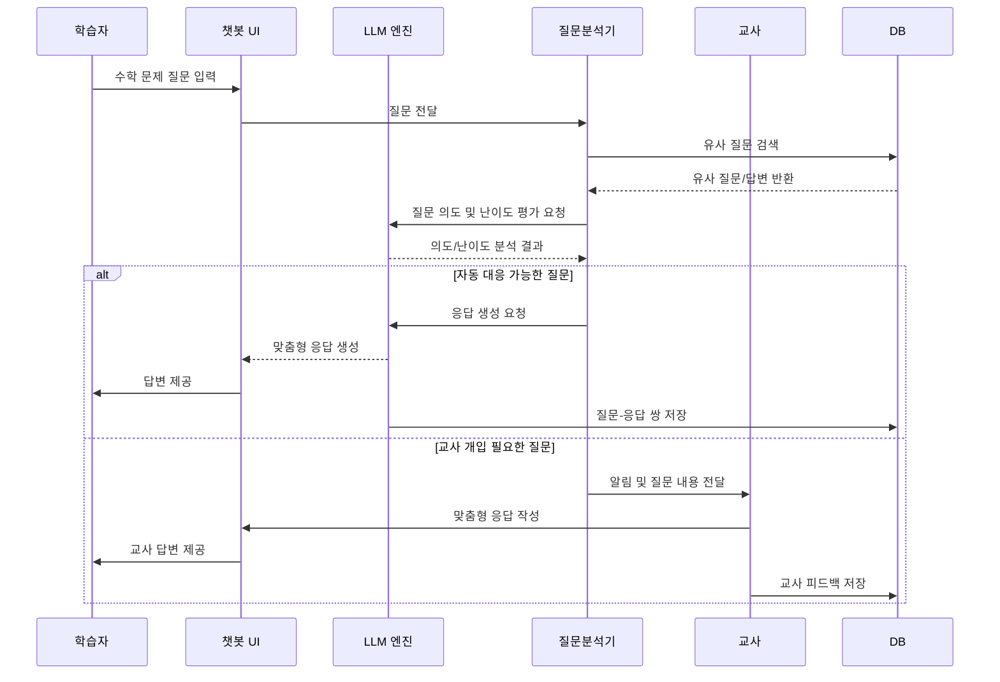
```mermaid
sequenceDiagram
    participant 학습자
    participant 챗봇 UI
    participant LLM 엔진
    participant 질문분석기
    participant 교사
    participant DB

    학습자->>챗봇 UI: 수학 문제 질문 입력
    챗봇 UI->>질문분석기: 질문 전달
    질문분석기->>DB: 유사 질문 검색
    DB-->>질문분석기: 유사 질문/답변 반환
    질문분석기->>LLM 엔진: 질문 의도 및 난이도 평가 요청
    LLM 엔진-->>질문분석기: 의도/난이도 분석 결과

    alt 자동 대응 가능한 질문
        질문분석기->>LLM 엔진: 응답 생성 요청
        LLM 엔진-->>챗봇 UI: 맞춤형 응답 생성
        챗봇 UI->>학습자: 답변 제공
        LLM 엔진->>DB: 질문-응답 쌍 저장
    else 교사 개입 필요한 질문
        질문분석기->>교사: 알림 및 질문 내용 전달
        교사->>챗봇 UI: 맞춤형 응답 작성
        챗봇 UI->>학습자: 교사 답변 제공
        교사->>DB: 교사 피드백 저장
    end
```

**프로세스 설명**:
1. **질문 입력 및 분석**: 학습자가 자연어로 질문을 입력하면 시스템이 질문의 의도와 난이도를 분석합니다.
2. **유사 질문 검색**: 내부 DB에서 유사한 질문과 응답 사례를 검색합니다.
3. **대응 방식 결정**: 
   - **자동 대응**: 시스템이 처리 가능한 질문은 LLM이 개념 기반으로 즉시 응답
   - **교사 연계**: 복잡하거나 중요한 질문은 교사에게 알림과 함께 전달
4. **지식 축적**: 모든 질문과 응답은 DB에 저장되어 시스템 학습에 활용됩니다.

이 접근 방식은 반복적인 질문은 AI가 처리하고, 중요한 질문은 교사가 대응하는 효율적인 시스템을 구현합니다.

#### LLM ChatBot - 사용자 경험 시각화

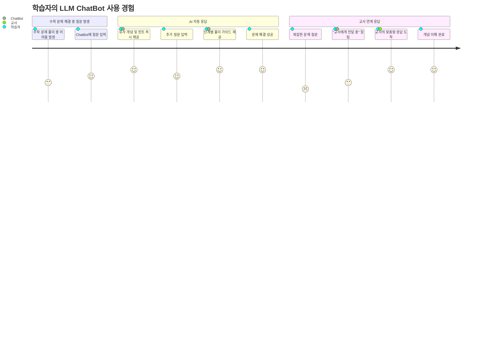
```mermaid
journey
    title 학습자의 LLM ChatBot 사용 경험
    section 수학 문제 해결 중 질문 발생
        수학 문제 풀이 중 어려움 발생: 3: 학습자
        ChatBot에 질문 입력: 4: 학습자
    section AI 자동 응답
        유사 개념 및 힌트 즉시 제공: 5: 학습자, ChatBot
        추가 질문 입력: 4: 학습자
        단계별 풀이 가이드 제공: 5: 학습자, ChatBot
        문제 해결 성공: 5: 학습자
    section 교사 연계 응답
        복잡한 문제 질문: 2: 학습자
        "교사에게 전달 중" 알림: 3: 학습자, ChatBot
        교사의 맞춤형 응답 도착: 5: 학습자, 교사
        개념 이해 완료: 5: 학습자
```

#### 사용자 시나리오 - LLM ChatBot

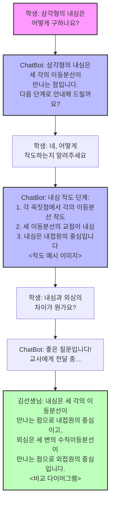
```mermaid
graph TD
    style 질문 fill:#f9f,stroke:#333,stroke-width:2px
    style 응답1 fill:#bbf,stroke:#333,stroke-width:2px
    style 응답2 fill:#bbf,stroke:#333,stroke-width:2px
    style 교사응답 fill:#bfb,stroke:#333,stroke-width:2px

    질문["학생: 삼각형의 내심은<br>어떻게 구하나요?"]
    응답1["ChatBot: 삼각형의 내심은<br>세 각의 이등분선이<br>만나는 점입니다.<br>다음 단계로 안내해 드릴까요?"]
    질문2["학생: 네, 어떻게<br>작도하는지 알려주세요"]
    응답2["ChatBot: 내심 작도 단계:<br>1. 각 꼭짓점에서 각의 이등분선 작도<br>2. 세 이등분선의 교점이 내심<br>3. 내심은 내접원의 중심입니다<br><작도 예시 이미지>"]
    질문3["학생: 내심과 외심의<br>차이가 뭔가요?"]
    중계["ChatBot: 좋은 질문입니다!<br>교사에게 전달 중..."]
    교사응답["김선생님: 내심은 세 각의 이등분선이<br>만나는 점으로 내접원의 중심이고,<br>외심은 세 변의 수직이등분선이<br>만나는 점으로 외접원의 중심입니다.<br><비교 다이어그램>"]
    
    질문 --> 응답1
    응답1 --> 질문2
    질문2 --> 응답2
    응답2 --> 질문3
    질문3 --> 중계
    중계 --> 교사응답
```

#### 세부 기능

| 구분 | 주요 기능 | 목적 |
|------|-----------|------|
| **자동 대응형** (시스템 주도) | • 자연어 질문 분석 및 분류 • 유사 질문 및 개념 기반 응답 자동 제공 • 교사 피드백 추천 항목 자동 제시 | • 반복 질문 자동 처리 • 교사의 개입 시점 판단 • 교사 리소스 최소화 |
| **추천 기반형** (교사 연계) | • 질문 난이도 판단 → 교사 알림 전송 • 유사 사례 및 피드백 history 제공 • 교사 응답 내용 기록 및 case화 | • 중요 질의는 휴먼터치 대응 • 응답 내용 축적으로 자동화 고도화 |

#### 시스템 아키텍처

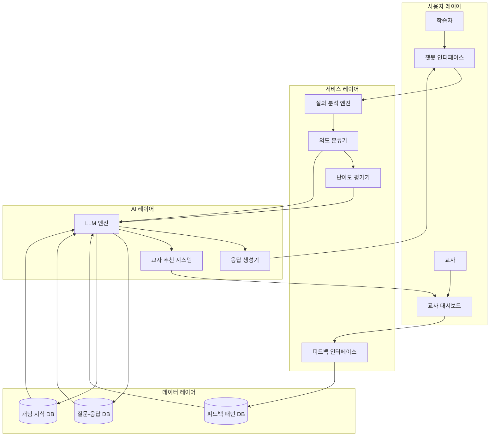
```mermaid
graph TB
    subgraph "사용자 레이어"
        A1[학습자] --> B1[챗봇 인터페이스]
        C1[교사] --> D1[교사 대시보드]
    end

    subgraph "서비스 레이어"
        B1 --> E1[질의 분석 엔진]
        E1 --> F1[의도 분류기]
        F1 --> G1[난이도 평가기]
        D1 --> H1[피드백 인터페이스]
    end

    subgraph "AI 레이어"
        F1 --> I1[LLM 엔진]
        G1 --> I1
        I1 --> J1[응답 생성기]
        I1 --> K1[교사 추천 시스템]
    end

    subgraph "데이터 레이어"
        L1[(질문-응답 DB)]
        M1[(개념 지식 DB)]
        N1[(피드백 패턴 DB)]
    end

    J1 --> B1
    K1 --> D1
    I1 --> L1
    I1 --> M1
    H1 --> N1
    N1 --> I1
    L1 --> I1
    M1 --> I1
```

#### 개발 로드맵 (WBS)

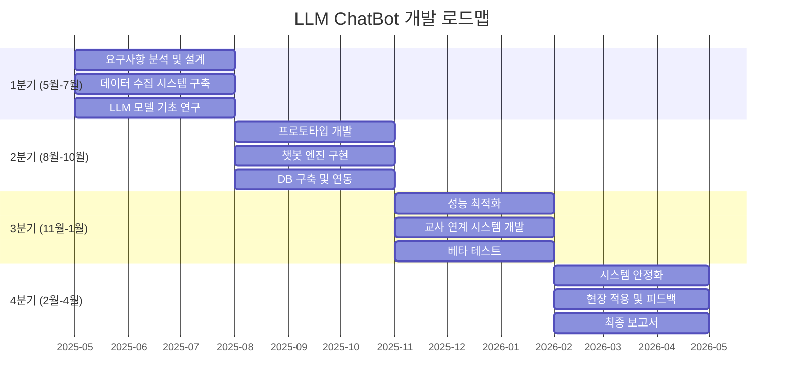
```mermaid
gantt
    title LLM ChatBot 개발 로드맵
    dateFormat YYYY-MM-DD
    axisFormat %Y-%m

    section 1분기 (5월-7월)
    요구사항 분석 및 설계    :2025-05-01, 3M
    데이터 수집 시스템 구축   :2025-05-01, 3M
    LLM 모델 기초 연구      :2025-05-01, 3M

    section 2분기 (8월-10월)
    프로토타입 개발        :2025-08-01, 3M
    챗봇 엔진 구현         :2025-08-01, 3M
    DB 구축 및 연동        :2025-08-01, 3M

    section 3분기 (11월-1월)
    성능 최적화           :2025-11-01, 3M
    교사 연계 시스템 개발   :2025-11-01, 3M
    베타 테스트           :2025-11-01, 3M

    section 4분기 (2월-4월)
    시스템 안정화         :2026-02-01, 3M
    현장 적용 및 피드백    :2026-02-01, 3M
    최종 보고서          :2026-02-01, 3M
```

#### LLM ChatBot 기술 접근법 비교

LLM ChatBot 구현을 위한 두 가지 주요 기술 접근법(파인튜닝과 Langraph)의 비교 분석과 각각의 장단점을 통해 최적의 개발 전략을 제시합니다.

##### 1. 파인튜닝 접근법

**개요**: 기존 LLM 모델(예: GPT-4)을 특정 교육 목적에 맞게 추가 학습시키는 방식

**장점**:
- 단일 모델로 구현 가능하여 아키텍처가 단순함
- 기본 모델의 지식을 유지하면서 특정 응답 패턴 학습 가능
- 최초 구현 시 상대적으로 적은 개발 리소스 필요

**한계**:
- 정답/해설 요청 회피 어려움: 학생이 교묘하게 답과 해설을 요구하면 파인튜닝된 모델도 결국 응답할 가능성 높음
- 컨텍스트 유지 어려움: 대화 맥락을 장기간 유지하며 학생의 개념 이해 상태를 추적하기 어려움
- 유연성 부족: 새로운 패턴의 질문이나 상황에 대응하기 위해 추가 파인튜닝 필요

**필요 데이터 요구사항**:
- 데이터 유형: 수학 문제, 학생 질문, 개념 설명 중심의 튜터 응답이 쌍으로 구성된 QA 데이터셋
- 필요 데이터 규모: 최소 1,000~10,000개 이상의 고품질 QA 쌍
- 데이터 품질 요구사항: 
  * 다양한 난이도, 개념, 질문 유형 포함
  * 문제 정답 회피 예시 포함 (예: "이 문제 답이 뭐야?" → 정답이 아닌 개념 설명으로 응답)
  * 다양한 학습 상황 및 학생 이해도 수준 반영

##### 2. Langraph 접근법

**개요**: LangChain 기반의 그래프 형태 워크플로우를 통해 명확한 로직 흐름과 상태 관리를 구현하는 방식

**장점**:
- 명확한 로직 제어: 질문 분석, 의도 파악, 개념 추출, 응답 생성 등의 단계를 명시적 그래프로 설계
- 조건부 분기 처리: 학생 정답 요청 시 개념 설명으로 리다이렉트하는 등의 명확한 분기 처리 가능
- 상태 관리: 대화 상태를 명시적으로 관리하여 학생의 이해도와 질문 패턴을 지속적으로 추적
- 외부 시스템 통합: DB 조회, 개념 지식 베이스 연결 등을 워크플로우에 자연스럽게 통합
- LLM 호출 최소화: 필요한 단계에서만 LLM을 호출하도록 설계하여 비용 절감 가능

**한계**:
- 초기 개발 복잡성: 그래프 워크플로우 설계와 구현에 더 많은 초기 개발 리소스 필요
- 개발자 역량 의존성: 효과적인 워크플로우 설계를 위한 도메인 지식과 기술적 역량 필요
- 지속적인 유지보수: 워크플로우의 지속적인 최적화와 관리 필요

**필요 데이터 요구사항**:
- 개념 지식 베이스: 
  * 수학 개념 설명, 예시, 연관 개념 관계를 포함한 구조화된 지식 DB
  * 규모: 수백~수천 개의 개념 (학년/과목 범위에 따라 다름)
- 문제-개념 매핑 데이터: 
  * 각 문제가 어떤 개념을 테스트하는지에 대한 매핑 정보
  * 규모: 문제 수에 비례 (수백~수천 개)
- 질문 의도 분류 예시: 
  * 정답 요청, 개념 설명 요청, 풀이 과정 요청 등 질문 의도 분류를 위한 예시
  * 규모: 수십~수백 개의 예시 (LLM의 few-shot 학습용)

##### 3. 최적 접근법: Langraph 기반 하이브리드 모델

**제안 방향**: Langraph 워크플로우를 기반으로 하되, 특정 노드에서 소규모 파인튜닝된 모델을 활용하는 하이브리드 접근법

**주요 구성요소**:
1. **핵심 워크플로우**: Langraph로 설계하여 명확한 로직 제어 구현
   - 질문 분석 → 의도 분류 → 개념 추출 → 응답 생성 → 피드백 수집의 명확한 흐름
   - 학습자 상태 추적 및 대화 맥락 유지를 위한 상태 관리 구현

2. **특화된 노드**: 중요 노드에 소규모 파인튜닝 모델 활용
   - 질문 의도 분류: 정답 요청 패턴을 정확히 감지하는 특화 모델
   - 개념 설명 생성: 수학 개념을 학생 수준에 맞게 설명하는 특화 모델

3. **DB 연동 메커니즘**: 
   - 유사 질문-응답 재활용 시스템으로 LLM 호출 최소화
   - 핵심 개념과 문제 연결 매핑으로 정확한 개념 추출
   - 학생 질문-응답 이력 관리로 개인화된 설명 제공

4. **비용 효율성**:
   - 초기 개발 비용은 파인튜닝보다 높을 수 있으나
   - 장기적으로 LLM 호출 최소화 및 재사용으로 운영 비용 절감
   - 유지보수 및 확장성 측면에서 더 효율적

**구현 전략**:
1. **초기 단계**: 핵심 개념 DB와 기본 Langraph 워크플로우 개발
2. **확장 단계**: 학생 피드백 기반으로 워크플로우 최적화 및 개념 DB 확장
3. **고도화 단계**: 학생별 학습 상태 추적 및 개인화된 응답 생성 시스템 구현

이 접근법은 개념 중심 설명, 정답 회피, DB 재활용, 교사 연계 등의 요구사항을 충족하면서도 장기적으로 유지보수와 확장이 용이한 시스템을 구현할 수 있습니다.

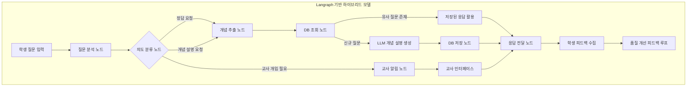
```mermaid
graph TD
    subgraph "Langraph 기반 하이브리드 모델"
        A[학생 질문 입력] --> B[질문 분석 노드]
        B --> C{의도 분류 노드}
        
        C -->|정답 요청| D[개념 추출 노드]
        C -->|개념 설명 요청| D
        C -->|교사 개입 필요| E[교사 알림 노드]
        
        D --> F[DB 조회 노드]
        F -->|유사 질문 존재| G[저장된 응답 활용]
        F -->|신규 질문| H[LLM 개념 설명 생성]
        
        G --> I[응답 전달 노드]
        H --> J[DB 저장 노드]
        J --> I
        E --> K[교사 인터페이스]
        K --> I
        
        I --> L[학생 피드백 수집]
        L --> M[품질 개선 피드백 루프]
    end
```

---

### 2. '다음 학습' 예측 추천 AI

#### 핵심 목표
학습자의 기존 학습 이력을 기반으로 다음 학습에서 가장 효과적인 활동(개념 복습/유형 훈련/테스트 등)을 자동으로 예측하고 개별 학습 목표에 최적화된 '**다음 학습 경로**'를 추천하는 AI 시스템 개발. 정적 커리큘럼이 아닌 실제 학습 이력 기반 동적 경로 설계 실현 → 학습 효율 극대화 + 튜터 업무 경감.

#### Use Case
학습자가 배정된 학습을 완료하면, AI가 학습자의 최근 학습 데이터(정오답, 소요 시간, 힌트 사용 여부 등)를 분석하여 개념 완성도와 유형별 이해도를 예측한 후, 복습, 훈련, 심화, 테스트 중 가장 효과적인 학습 활동을 자동으로 추천. 또한, 튜터는 AI가 제공한 추천 리스트와 데이터 기반 근거를 참고하여 학습자의 다음 학습 경로를 최적화.

#### '다음 학습' 예측 추천 AI 사용자 흐름도

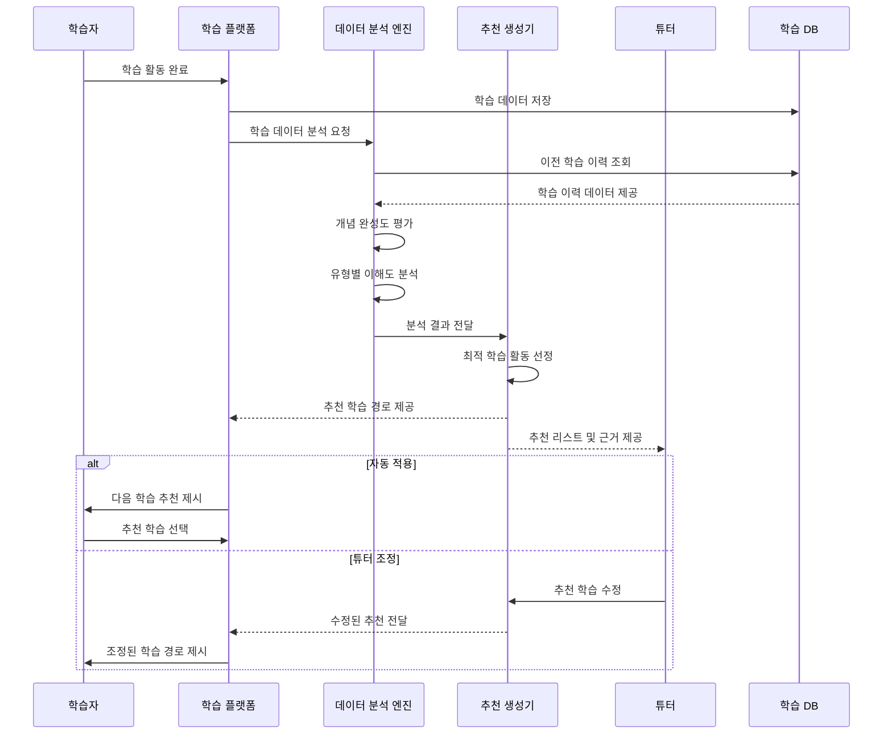
```mermaid
sequenceDiagram
    participant 학습자
    participant 학습 플랫폼
    participant 데이터 분석 엔진
    participant 추천 생성기
    participant 튜터
    participant 학습 DB

    학습자->>학습 플랫폼: 학습 활동 완료
    학습 플랫폼->>학습 DB: 학습 데이터 저장
    학습 플랫폼->>데이터 분석 엔진: 학습 데이터 분석 요청
    데이터 분석 엔진->>학습 DB: 이전 학습 이력 조회
    학습 DB-->>데이터 분석 엔진: 학습 이력 데이터 제공
    
    데이터 분석 엔진->>데이터 분석 엔진: 개념 완성도 평가
    데이터 분석 엔진->>데이터 분석 엔진: 유형별 이해도 분석
    데이터 분석 엔진->>추천 생성기: 분석 결과 전달
    
    추천 생성기->>추천 생성기: 최적 학습 활동 선정
    추천 생성기-->>학습 플랫폼: 추천 학습 경로 제공
    추천 생성기-->>튜터: 추천 리스트 및 근거 제공
    
    alt 자동 적용
        학습 플랫폼->>학습자: 다음 학습 추천 제시
        학습자->>학습 플랫폼: 추천 학습 선택
    else 튜터 조정
        튜터->>추천 생성기: 추천 학습 수정
        추천 생성기-->>학습 플랫폼: 수정된 추천 전달
        학습 플랫폼->>학습자: 조정된 학습 경로 제시
    end
```

**프로세스 설명**:
1. **학습 데이터 수집**: 학습자가 학습을 완료하면 정오답, 소요 시간, 힌트 사용 여부 등의 데이터가 수집됩니다.
2. **데이터 분석**: 시스템이 최근 학습 데이터와 누적 이력을 분석하여 개념 완성도와 유형별 이해도를 평가합니다.
3. **추천 생성**: 분석 결과를 바탕으로 다음 학습에 가장 적합한 활동(복습/새로운 개념/연습 문제/테스트)을 추천합니다.
4. **경로 결정**:
   - **자동 적용**: 학습자에게 직접 추천 학습 경로 제시
   - **튜터 조정**: 튜터가 추천 내용을 검토하고 필요시 조정하여 제공

이 시스템은 정적인 커리큘럼이 아닌 학습자의 실제 이해도와 진행 상황에 맞춰 동적으로 최적의 학습 경로를 제시합니다.

#### 다음 학습 예측 추천 AI - 사용자 경험 시각화

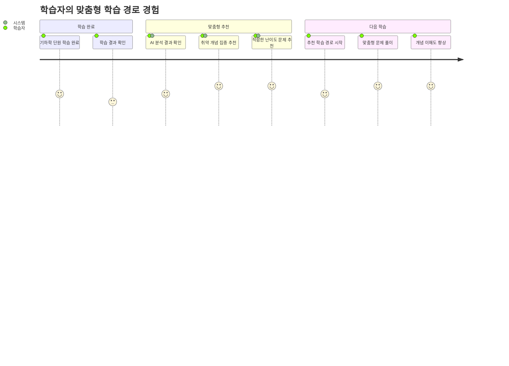
```mermaid
journey
    title 학습자의 맞춤형 학습 경로 경험
    section 학습 완료
        기하학 단원 학습 완료: 4: 학습자
        학습 결과 확인: 3: 학습자
    section 맞춤형 추천
        AI 분석 결과 확인: 4: 학습자, 시스템
        취약 개념 집중 추천: 5: 학습자, 시스템
        적합한 난이도 문제 추천: 5: 학습자, 시스템
    section 다음 학습
        추천 학습 경로 시작: 4: 학습자
        맞춤형 문제 풀이: 5: 학습자
        개념 이해도 향상: 5: 학습자
```

#### 사용자 시나리오 - 다음 학습 예측 추천 AI

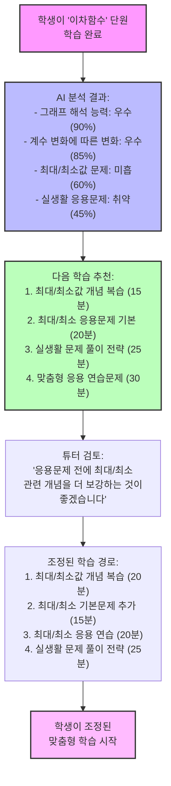
```mermaid
graph TD
    style 학습완료 fill:#f9f,stroke:#333,stroke-width:2px
    style 분석결과 fill:#bbf,stroke:#333,stroke-width:2px
    style 추천경로 fill:#bfb,stroke:#333,stroke-width:2px
    style 학습시작 fill:#fbf,stroke:#333,stroke-width:2px

    학습완료["학생이 '이차함수' 단원<br>학습 완료"]
    분석결과["AI 분석 결과:<br>- 그래프 해석 능력: 우수(90%)<br>- 계수 변화에 따른 변화: 우수(85%)<br>- 최대/최소값 문제: 미흡(60%)<br>- 실생활 응용문제: 취약(45%)"]
    
    추천경로["다음 학습 추천:<br>1. 최대/최소값 개념 복습 (15분)<br>2. 최대/최소 응용문제 기본 (20분)<br>3. 실생활 문제 풀이 전략 (25분)<br>4. 맞춤형 응용 연습문제 (30분)"]
    
    튜터검토["튜터 검토:<br>'응용문제 전에 최대/최소<br>관련 개념을 더 보강하는 것이<br>좋겠습니다'"]
    
    조정경로["조정된 학습 경로:<br>1. 최대/최소값 개념 복습 (20분)<br>2. 최대/최소 기본문제 추가 (15분)<br>3. 최대/최소 응용 연습 (20분)<br>4. 실생활 문제 풀이 전략 (25분)"]
    
    학습시작["학생이 조정된<br>맞춤형 학습 시작"]
    
    학습완료 --> 분석결과
    분석결과 --> 추천경로
    추천경로 --> 튜터검토
    튜터검토 --> 조정경로
    조정경로 --> 학습시작
```

#### 주요 기능

| 구분 | 주요 기능 | 목적 |
|------|-----------|------|
| **자동 추천형** (시스템 주도) | • 최근 학습 데이터 분석 • 개념 완성도 및 유형별 이해도 예측 • 최적 학습 활동 자동 추천 | • AI의 학습 흐름 자동 관리 • 콘텐츠 선택 시간 최소화 • 개인 맞춤형 학습 실현 |
| **교사 보조형** (교사 연계) | • 데이터 기반 추천 리스트 제공 • 추천 이유와 근거 함께 제공 • 튜터의 수정/적용 선택권 부여 | • 커리큘럼 설정 부담 감소 • 데이터 기반 신뢰도 확보 • 튜터 전문성과 AI 연계 |

#### 시스템 아키텍처

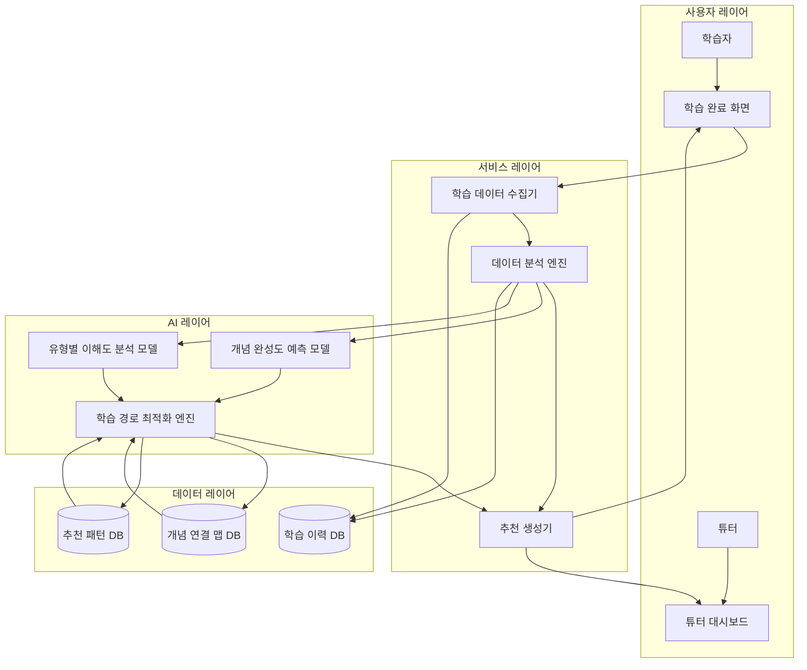
```mermaid
graph TB
    subgraph "사용자 레이어"
        A2[학습자] --> B2[학습 완료 화면]
        C2[튜터] --> D2[튜터 대시보드]
    end

    subgraph "서비스 레이어"
        B2 --> E2[학습 데이터 수집기]
        E2 --> F2[데이터 분석 엔진]
        F2 --> G2[추천 생성기]
        G2 --> B2
        G2 --> D2
    end

    subgraph "AI 레이어"
        F2 --> H2[개념 완성도 예측 모델]
        F2 --> I2[유형별 이해도 분석 모델]
        H2 --> J2[학습 경로 최적화 엔진]
        I2 --> J2
        J2 --> G2
    end

    subgraph "데이터 레이어"
        K2[(학습 이력 DB)]
        L2[(개념 연결 맵 DB)]
        M2[(추천 패턴 DB)]
    end

    E2 --> K2
    F2 --> K2
    J2 --> L2
    J2 --> M2
    M2 --> J2
    L2 --> J2
```

#### 개발 로드맵 (WBS)

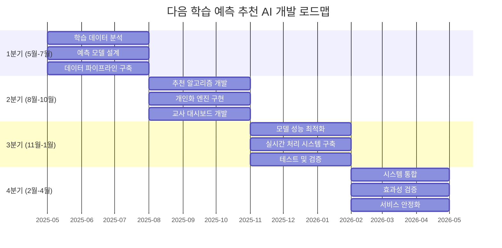
```mermaid
gantt
    title 다음 학습 예측 추천 AI 개발 로드맵
    dateFormat YYYY-MM-DD
    axisFormat %Y-%m

    section 1분기 (5월-7월)
    학습 데이터 분석        :2025-05-01, 3M
    예측 모델 설계         :2025-05-01, 3M
    데이터 파이프라인 구축   :2025-05-01, 3M

    section 2분기 (8월-10월)
    추천 알고리즘 개발      :2025-08-01, 3M
    개인화 엔진 구현        :2025-08-01, 3M
    교사 대시보드 개발      :2025-08-01, 3M

    section 3분기 (11월-1월)
    모델 성능 최적화        :2025-11-01, 3M
    실시간 처리 시스템 구축  :2025-11-01, 3M
    테스트 및 검증         :2025-11-01, 3M

    section 4분기 (2월-4월)
    시스템 통합           :2026-02-01, 3M
    효과성 검증           :2026-02-01, 3M
    서비스 안정화         :2026-02-01, 3M
```

---

### 3. 실시간 '집중도 분석' + 피드백 제안

#### 핵심 목표
학습 중 실시간으로 수집되는 행동 데이터(문제 풀이 시간, 연속 정답률, 필기 속도 등)를 기반으로 AI가 학습자의 집중도 상태를 실시간 분석하고, 집중력 저하 시 적절한 학습 전략(휴식 제안, 유형 전환, 동기 부여 메시지 등)을 자동 제공하는 시스템 개발. 단순한 시간 제어가 아닌 **행동 기반 집중도 인식 → 맞춤형 개입 설계 → 지속 가능한 학습 흐름 유도** 실현.

#### Use Case
학습자가 문제 풀이 등 학습 활동 중에 보이는 행동 데이터를 실시간으로 수집하면, AI가 문제 풀이 시간, 연속 정답률, 필기 속도, 힌트 요청 패턴 등의 데이터를 분석해 집중도 점수를 산출하고, 이 점수가 기준 이하로 떨어질 경우 휴식, 문제 유형 전환, 동기 부여 메시지 등의 맞춤형 피드백을 자동으로 제공. 또한, 누적된 집중도 데이터를 기반으로 개인별 이상적인 학습 리듬과 콘텐츠를 추천하며, 주간 리포트를 통해 학부모와 튜터에게 학습 패턴을 공유함으로써 장기적인 학습 몰입과 효율 상승.

#### 실시간 '집중도 분석' + 피드백 제안 흐름도

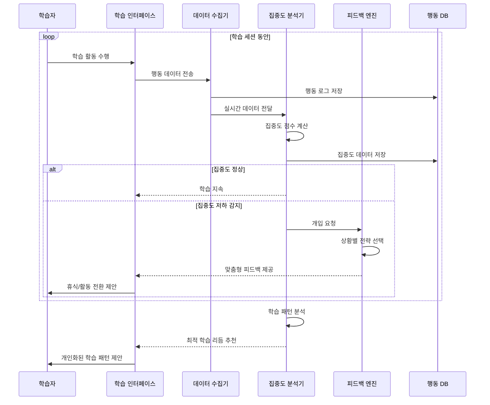
```mermaid
sequenceDiagram
    participant 학습자
    participant 학습 인터페이스
    participant 데이터 수집기
    participant 집중도 분석기
    participant 피드백 엔진
    participant 행동 DB

    loop 학습 세션 동안
        학습자->>학습 인터페이스: 학습 활동 수행
        학습 인터페이스->>데이터 수집기: 행동 데이터 전송
        데이터 수집기->>행동 DB: 행동 로그 저장
        데이터 수집기->>집중도 분석기: 실시간 데이터 전달
        
        집중도 분석기->>집중도 분석기: 집중도 점수 계산
        집중도 분석기->>행동 DB: 집중도 데이터 저장
        
        alt 집중도 정상
            집중도 분석기-->>학습 인터페이스: 학습 지속
        else 집중도 저하 감지
            집중도 분석기->>피드백 엔진: 개입 요청
            피드백 엔진->>피드백 엔진: 상황별 전략 선택
            피드백 엔진-->>학습 인터페이스: 맞춤형 피드백 제공
            학습 인터페이스->>학습자: 휴식/활동 전환 제안
        end
    end
    
    집중도 분석기->>집중도 분석기: 학습 패턴 분석
    집중도 분석기-->>학습 인터페이스: 최적 학습 리듬 추천
    학습 인터페이스->>학습자: 개인화된 학습 패턴 제안
```

**프로세스 설명**:
1. **실시간 데이터 수집**: 학습자의 문제 풀이 시간, 정답률 변화, 마우스/펜 움직임, 입력 속도 등을 지속적으로 모니터링합니다.
2. **집중도 분석**: 수집된 행동 데이터를 기반으로 실시간 집중도 점수를 산출합니다.
3. **적시 개입**:
   - **정상 상태**: 집중도가 유지될 때는 학습 활동이 중단 없이 계속됩니다.
   - **집중도 저하**: 집중도가 임계치 이하로 떨어지면 시스템이 개입하여 휴식, 활동 전환, 동기 부여 메시지 등 맞춤형 피드백을 제공합니다.
4. **패턴 최적화**: 장기적인 데이터를 분석하여 학습자별 최적의 학습 리듬(집중-휴식 패턴, 선호 콘텐츠 유형 등)을 발견하고 추천합니다.

이 시스템은 학습자의 집중력을 실시간으로 모니터링하여 최적의 학습 상태를 유지하도록 지원합니다.

#### 실시간 집중도 분석 시스템 - 사용자 경험 시각화

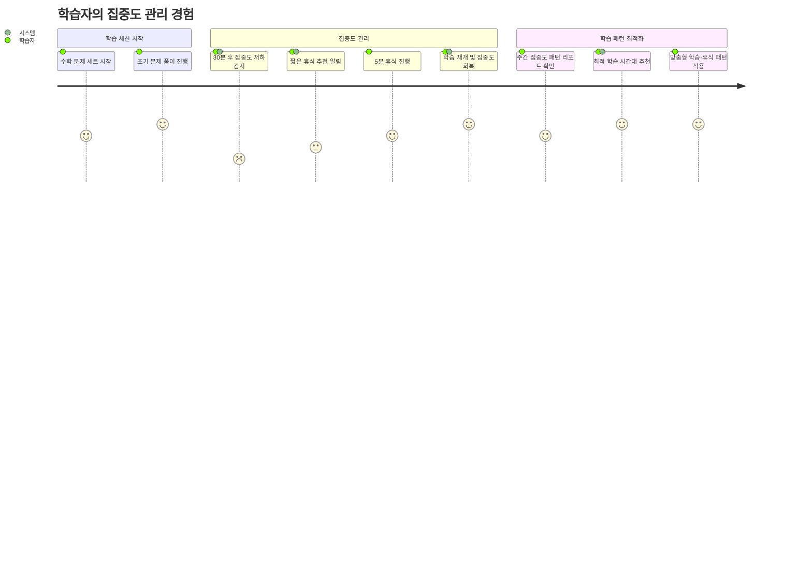
```mermaid
journey
    title 학습자의 집중도 관리 경험
    section 학습 세션 시작
        수학 문제 세트 시작: 4: 학습자
        초기 문제 풀이 진행: 5: 학습자
    section 집중도 관리
        30분 후 집중도 저하 감지: 2: 학습자, 시스템
        짧은 휴식 추천 알림: 3: 학습자, 시스템
        5분 휴식 진행: 4: 학습자
        학습 재개 및 집중도 회복: 5: 학습자, 시스템
    section 학습 패턴 최적화
        주간 집중도 패턴 리포트 확인: 4: 학습자
        최적 학습 시간대 추천: 5: 학습자, 시스템
        맞춤형 학습-휴식 패턴 적용: 5: 학습자
```

#### 사용자 시나리오 - 실시간 집중도 분석 시스템

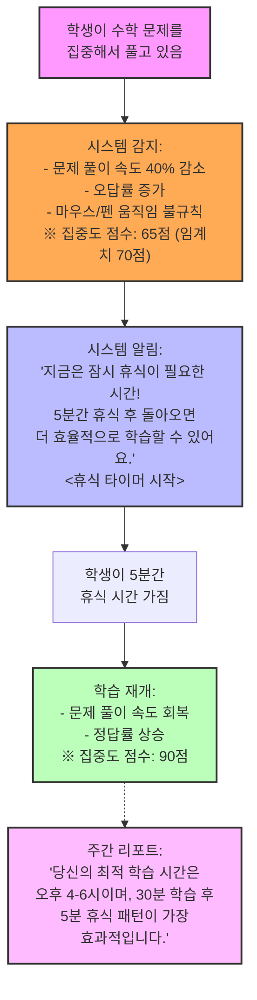
```mermaid
graph TD
    style 학습중 fill:#f9f,stroke:#333,stroke-width:2px
    style 집중저하 fill:#fa5,stroke:#333,stroke-width:2px
    style 휴식제안 fill:#bbf,stroke:#333,stroke-width:2px
    style 학습재개 fill:#bfb,stroke:#333,stroke-width:2px
    style 패턴추천 fill:#fbf,stroke:#333,stroke-width:2px

    학습중["학생이 수학 문제를<br>집중해서 풀고 있음"]
    집중저하["시스템 감지:<br>- 문제 풀이 속도 40% 감소<br>- 오답률 증가<br>- 마우스/펜 움직임 불규칙<br>※ 집중도 점수: 65점 (임계치 70점)"]
    
    휴식제안["시스템 알림:<br>'지금은 잠시 휴식이 필요한 시간!<br>5분간 휴식 후 돌아오면<br>더 효율적으로 학습할 수 있어요.'<br><휴식 타이머 시작>"]
    
    휴식["학생이 5분간<br>휴식 시간 가짐"]
    학습재개["학습 재개:<br>- 문제 풀이 속도 회복<br>- 정답률 상승<br>※ 집중도 점수: 90점"]
    
    패턴추천["주간 리포트:<br>'당신의 최적 학습 시간은<br>오후 4-6시이며, 30분 학습 후<br>5분 휴식 패턴이 가장<br>효과적입니다.'"]
    
    학습중 --> 집중저하
    집중저하 --> 휴식제안
    휴식제안 --> 휴식
    휴식 --> 학습재개
    학습재개 -.-> 패턴추천
```

#### 주요 기능

| 구분 | 주요 기능 | 목적 |
|------|-----------|------|
| **집중도 자동 감지**  (시스템 주도형) | • 실시간 행동 데이터 분석 • 학습 집중도 점수 산출 • 집중도 저하 시 AI 개입 | • 비효율적 학습 방지 • AI 주도 학습 리듬 조절 |
| **학습 패턴 최적화**  (개인 맞춤형) | • 이상적 학습 리듬 추천 • 주간 집중도 리포트 제공 • 효과적 콘텐츠 포맷 분석 | • 개인별 몰입 강화 • 학습 지속성 향상 |

#### 시스템 아키텍처

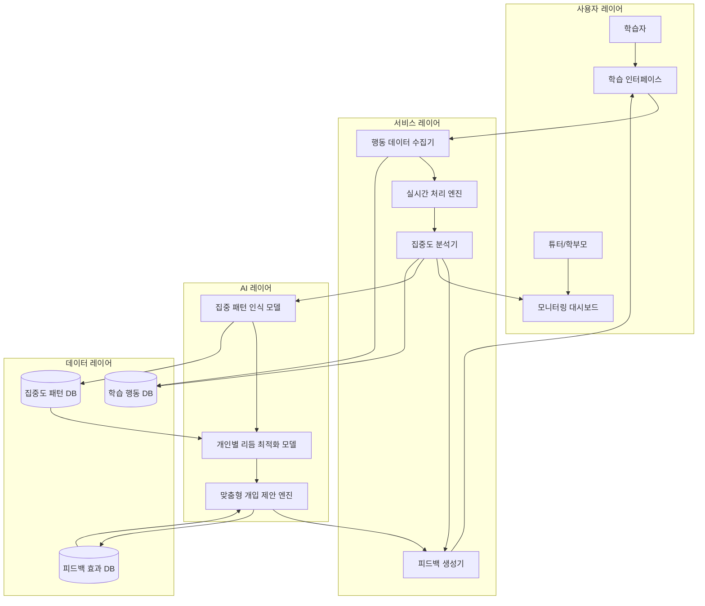
```mermaid
graph TB
    subgraph "사용자 레이어"
        A3[학습자] --> B3[학습 인터페이스]
        C3[튜터/학부모] --> D3[모니터링 대시보드]
    end

    subgraph "서비스 레이어"
        B3 --> E3[행동 데이터 수집기]
        E3 --> F3[실시간 처리 엔진]
        F3 --> G3[집중도 분석기]
        G3 --> H3[피드백 생성기]
        H3 --> B3
        G3 --> D3
    end

    subgraph "AI 레이어"
        G3 --> I3[집중 패턴 인식 모델]
        I3 --> J3[개인별 리듬 최적화 모델]
        J3 --> K3[맞춤형 개입 제안 엔진]
        K3 --> H3
    end

    subgraph "데이터 레이어"
        L3[(학습 행동 DB)]
        M3[(집중도 패턴 DB)]
        N3[(피드백 효과 DB)]
    end

    E3 --> L3
    G3 --> L3
    I3 --> M3
    K3 --> N3
    M3 --> J3
    N3 --> K3
```

#### 개발 로드맵 (WBS)

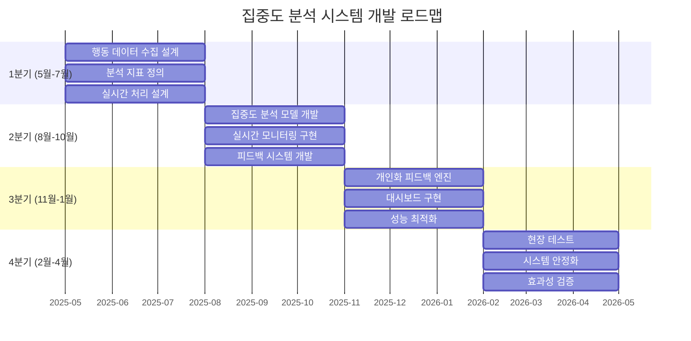
```mermaid
gantt
    title 집중도 분석 시스템 개발 로드맵
    dateFormat YYYY-MM-DD
    axisFormat %Y-%m

    section 1분기 (5월-7월)
    행동 데이터 수집 설계    :2025-05-01, 3M
    분석 지표 정의         :2025-05-01, 3M
    실시간 처리 설계       :2025-05-01, 3M

    section 2분기 (8월-10월)
    집중도 분석 모델 개발   :2025-08-01, 3M
    실시간 모니터링 구현    :2025-08-01, 3M
    피드백 시스템 개발     :2025-08-01, 3M

    section 3분기 (11월-1월)
    개인화 피드백 엔진     :2025-11-01, 3M
    대시보드 구현         :2025-11-01, 3M
    성능 최적화          :2025-11-01, 3M

    section 4분기 (2월-4월)
    현장 테스트          :2026-02-01, 3M
    시스템 안정화        :2026-02-01, 3M
    효과성 검증         :2026-02-01, 3M
```

---

### 4. 이탈 예측 모델링 및 사전 알림 시스템

#### 핵심 목표
학습자의 행동 데이터를 정밀 추적 및 분석하여, 이탈(탈락) 가능성이 높은 징후를 조기에 탐지하고 튜터 또는 보호자에게 사전 알림 및 맞춤형 개입 시그널을 제공하는 AI 기반 이탈 예측 및 예방 시스템 구축. 정답률·활동량 등 단일 지표가 아닌 **복합적 행동 패턴의 변화를 감지**하여, 이탈하기 전에 적극적인 재개입과 동기 부여가 가능하도록 지원.

#### Use Case
학습자가 최근 3~7일간 문제 풀이 수, 로그인 빈도, 정답률 등 주요 학습 지표에서 하락세를 보이면, AI가 이를 종합적으로 분석해 '**이탈 리스크 지수**'를 산출하고 위험 등급(관심/주의/위험)을 분류. 위험 등급이 '주의' 이상으로 판정될 경우, 시스템은 튜터와 보호자에게 사전 알림을 전송해 맞춤형 피드백과 동기 부여 메시지, 추가 과제 제안 등을 제공함으로써 학습자가 이탈하기 전에 적극적인 재개입이 이루어지도록 지원.

#### 이탈 예측 모델링 및 사전 알림 시스템 흐름도

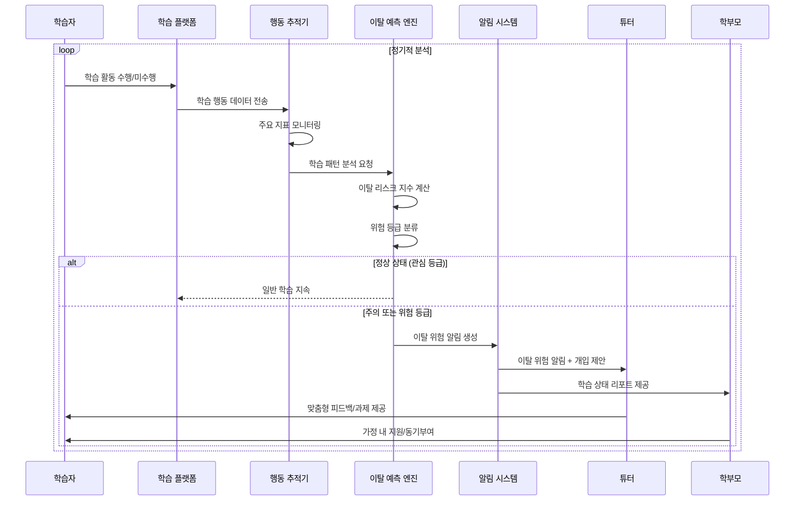
```mermaid
sequenceDiagram
    participant 학습자
    participant 학습 플랫폼
    participant 행동 추적기
    participant 이탈 예측 엔진
    participant 알림 시스템
    participant 튜터
    participant 학부모

    loop 정기적 분석
        학습자->>학습 플랫폼: 학습 활동 수행/미수행
        학습 플랫폼->>행동 추적기: 학습 행동 데이터 전송
        행동 추적기->>행동 추적기: 주요 지표 모니터링
        행동 추적기->>이탈 예측 엔진: 학습 패턴 분석 요청
        
        이탈 예측 엔진->>이탈 예측 엔진: 이탈 리스크 지수 계산
        이탈 예측 엔진->>이탈 예측 엔진: 위험 등급 분류
        
        alt 정상 상태 (관심 등급)
            이탈 예측 엔진-->>학습 플랫폼: 일반 학습 지속
        else 주의 또는 위험 등급
            이탈 예측 엔진->>알림 시스템: 이탈 위험 알림 생성
            알림 시스템->>튜터: 이탈 위험 알림 + 개입 제안
            알림 시스템->>학부모: 학습 상태 리포트 제공
            
            튜터->>학습자: 맞춤형 피드백/과제 제공
            학부모->>학습자: 가정 내 지원/동기부여
        end
    end
```

**프로세스 설명**:
1. **행동 데이터 모니터링**: 시스템이 학습자의 주요 행동 지표(로그인 빈도, 문제 풀이 수, 정답률, 질문 빈도 등)를 지속적으로 추적합니다.
2. **이탈 위험 분석**: 최근 3~7일간의 행동 패턴 변화를 분석하여 '이탈 리스크 지수'를 산출하고 위험 등급(관심/주의/위험)으로 분류합니다.
3. **조기 개입 체계**:
   - **관심 등급**: 정상적인 학습 진행
   - **주의/위험 등급**: 튜터와 학부모에게 알림을 보내 조기 개입 유도
4. **다각적 지원**: 튜터는 학습 측면에서, 학부모는 정서적/환경적 측면에서 지원하여 학습자의 이탈을 방지합니다.

이 시스템은 학습자가 완전히 이탈하기 전에 조기 징후를 감지하고 선제적인 조치를 취함으로써 학습 지속성을 높입니다.

#### 이탈 예측 시스템 - 사용자 경험 시각화

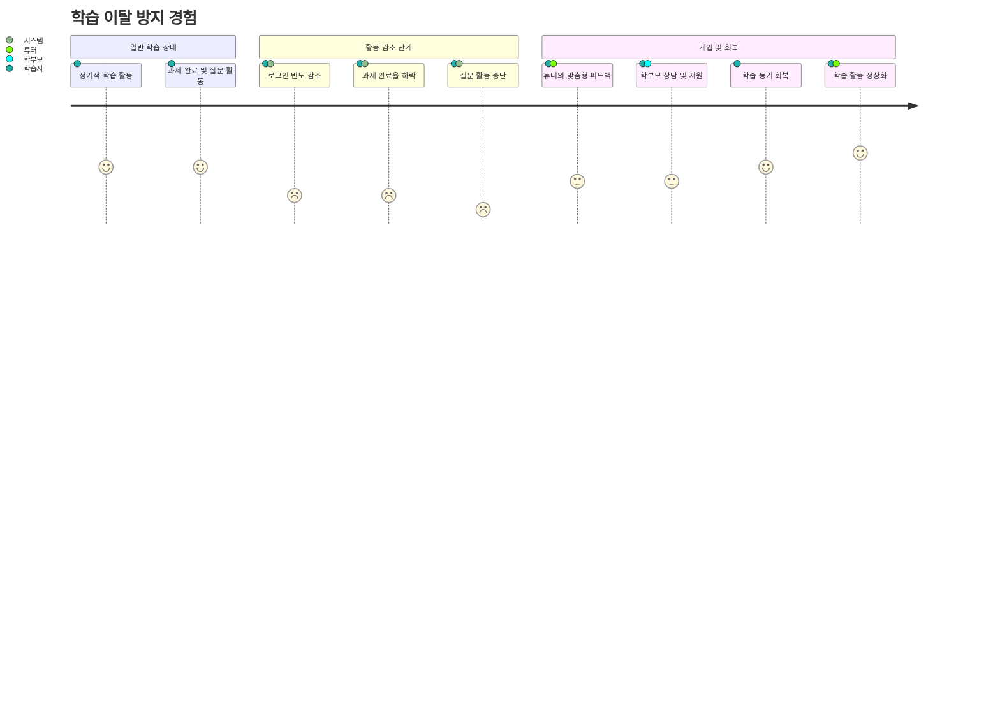
```mermaid
journey
    title 학습 이탈 방지 경험
    section 일반 학습 상태
        정기적 학습 활동: 4: 학습자
        과제 완료 및 질문 활동: 4: 학습자
    section 활동 감소 단계
        로그인 빈도 감소: 2: 학습자, 시스템
        과제 완료율 하락: 2: 학습자, 시스템
        질문 활동 중단: 1: 학습자, 시스템
    section 개입 및 회복
        튜터의 맞춤형 피드백: 3: 학습자, 튜터
        학부모 상담 및 지원: 3: 학습자, 학부모
        학습 동기 회복: 4: 학습자
        학습 활동 정상화: 5: 학습자, 튜터
```

#### 사용자 시나리오 - 이탈 예측 시스템

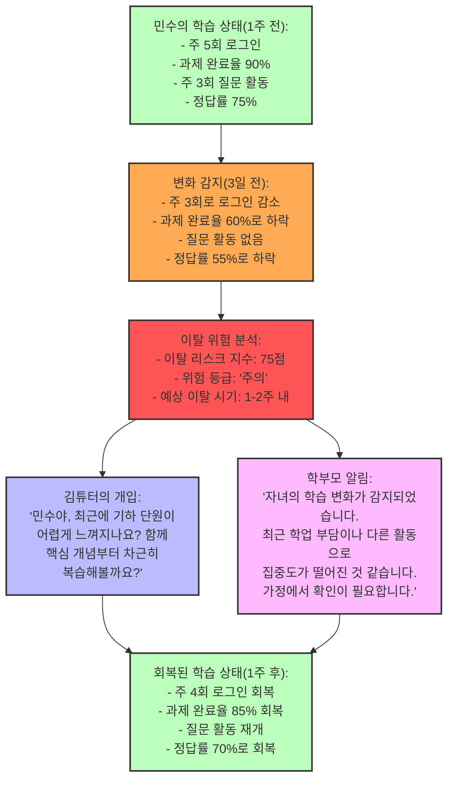
```mermaid
graph TD
    style 정상학습 fill:#bfb,stroke:#333,stroke-width:2px
    style 이상징후 fill:#fa5,stroke:#333,stroke-width:2px
    style 위험감지 fill:#f55,stroke:#333,stroke-width:2px
    style 튜터개입 fill:#bbf,stroke:#333,stroke-width:2px
    style 학부모알림 fill:#fbf,stroke:#333,stroke-width:2px
    style 회복상태 fill:#bfb,stroke:#333,stroke-width:2px

    정상학습["민수의 학습 상태(1주 전):<br>- 주 5회 로그인<br>- 과제 완료율 90%<br>- 주 3회 질문 활동<br>- 정답률 75%"]
    
    이상징후["변화 감지(3일 전):<br>- 주 3회로 로그인 감소<br>- 과제 완료율 60%로 하락<br>- 질문 활동 없음<br>- 정답률 55%로 하락"]
    
    위험감지["이탈 위험 분석:<br>- 이탈 리스크 지수: 75점<br>- 위험 등급: '주의'<br>- 예상 이탈 시기: 1-2주 내"]
    
    튜터개입["김튜터의 개입:<br>'민수야, 최근에 기하 단원이<br>어렵게 느껴지나요? 함께<br>핵심 개념부터 차근히<br>복습해볼까요?'"]
    
    학부모알림["학부모 알림:<br>'자녀의 학습 변화가 감지되었습니다.<br>최근 학업 부담이나 다른 활동으로<br>집중도가 떨어진 것 같습니다.<br>가정에서 확인이 필요합니다.'"]
    
    회복상태["회복된 학습 상태(1주 후):<br>- 주 4회 로그인 회복<br>- 과제 완료율 85% 회복<br>- 질문 활동 재개<br>- 정답률 70%로 회복"]
    
    정상학습 --> 이상징후
    이상징후 --> 위험감지
    위험감지 --> 튜터개입
    위험감지 --> 학부모알림
    튜터개입 --> 회복상태
    학부모알림 --> 회복상태
```

#### 주요 기능

| 구분 | 주요 기능 | 목적 |
|------|-----------|------|
| **이탈 위험 자동 예측**  (데이터 기반 분석) | • 학습량, 정답률, 질문 빈도 등 모니터링 • '이탈 리스크 지수' 산출 • 위험 등급(관심/주의/위험) 분류 | • 이탈 징후 조기 대응 • AI 기반 사전 모니터링 체계 |
| **사전 개입 및 커뮤니케이션** | • 튜터 즉시 알림 시스템 • 학부모 대상 맞춤형 리포트 • 자동 동기부여 메시지 발송 | • 이탈 사전 차단 • 적절한 타이밍 개입으로 학습 지속성 확보 |

#### 시스템 아키텍처

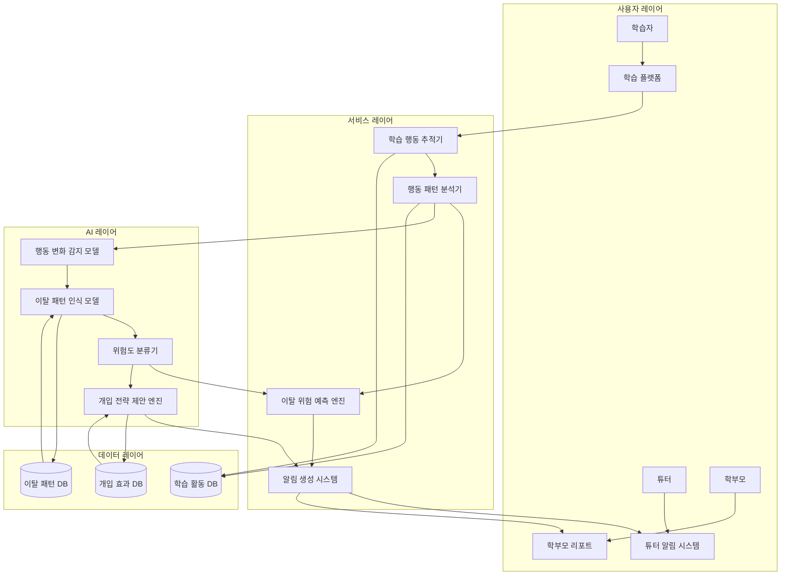
```mermaid
graph TB
    subgraph "사용자 레이어"
        A4[학습자] --> B4[학습 플랫폼]
        C4[튜터] --> D4[튜터 알림 시스템]
        E4[학부모] --> F4[학부모 리포트]
    end

    subgraph "서비스 레이어"
        B4 --> G4[학습 행동 추적기]
        G4 --> H4[행동 패턴 분석기]
        H4 --> I4[이탈 위험 예측 엔진]
        I4 --> J4[알림 생성 시스템]
        J4 --> D4
        J4 --> F4
    end

    subgraph "AI 레이어"
        H4 --> K4[행동 변화 감지 모델]
        K4 --> L4[이탈 패턴 인식 모델]
        L4 --> M4[위험도 분류기]
        M4 --> I4
        M4 --> N4[개입 전략 제안 엔진]
        N4 --> J4
    end

    subgraph "데이터 레이어"
        O4[(학습 활동 DB)]
        P4[(이탈 패턴 DB)]
        Q4[(개입 효과 DB)]
    end

    G4 --> O4
    H4 --> O4
    L4 --> P4
    N4 --> Q4
    Q4 --> N4
    P4 --> L4
```

#### 개발 로드맵 (WBS)

```mermaid
gantt
    title 이탈 예측 시스템 개발 로드맵
    dateFormat YYYY-MM-DD
    axisFormat %Y-%m

    section 1분기 (5월-7월)
    이탈 패턴 분석        :2025-05-01, 3M
    예측 모델 설계        :2025-05-01, 3M
    데이터 수집 시스템    :2025-05-01, 3M

    section 2분기 (8월-10월)
    예측 알고리즘 개발    :2025-08-01, 3M
    알림 시스템 구현      :2025-08-01, 3M
    리스크 평가 모델      :2025-08-01, 3M

    section 3분기 (11월-1월)
    자동 개입 시스템      :2025-11-01, 3M
    통합 대시보드        :2025-11-01, 3M
    성능 최적화         :2025-11-01, 3M

    section 4분기 (2월-4월)
    실제 적용 및 검증    :2026-02-01, 3M
    시스템 고도화       :2026-02-01, 3M
    효과성 분석        :2026-02-01, 3M
```

---

### 5. 학습 동기 유발 AI 코칭 챗봇

#### 핵심 목표
학습자의 성취도, 리텐션 이력, 피로도 등 실시간 학습 데이터를 바탕으로 격려, 리마인더, 목표 리마인드 등의 대화형 피드백을 제공하는 AI 기반 학습 동기 유발 챗봇(CoachBot) 개발. 튜터의 개입이 어렵거나, 동기가 낮은 학습자들에게 **심리적 거리 없는 정서적 지지와 자기주도적 동기 강화**를 제공하여 학습 지속률과 몰입도를 향상시키는 것이 목표임.

#### Use Case
학습자가 일정 기간 접속하지 않거나 정답률이 급락하는 등 이상 패턴이 감지되면, AI 코칭 챗봇(CoachBot)이 학습자의 최근 성과 및 리텐션 데이터를 분석하여 '학습 동기 수준'을 산출하고, 이에 맞춰 칭찬, 격려, 목표 리마인드 등의 맞춤형 코칭 메시지를 자동으로 전송. 이를 통해 무기력이나 학습 중단으로 이어지기 전에 적절한 심리적 지지와 동기 부여를 제공해 학습 지속률과 몰입도 상승.

#### 학습 동기 유발 AI 코칭 챗봇 흐름도

```mermaid
sequenceDiagram
    participant 학습자
    participant 코칭 챗봇
    participant 데이터 분석기
    participant 동기 평가기
    participant 메시지 생성기
    participant 학습 DB

    alt 정기적 코칭
        코칭 챗봇->>데이터 분석기: 정기 평가 요청
        데이터 분석기->>학습 DB: 최근 학습 데이터 요청
        학습 DB-->>데이터 분석기: 학습 이력 제공
    else 이상 패턴 감지
        학습자->>학습 DB: 학습 활동 저조/패턴 변화
        학습 DB->>데이터 분석기: 이상 패턴 알림
    end
    
    데이터 분석기->>동기 평가기: 학습 데이터 전달
    동기 평가기->>동기 평가기: 동기 수준 평가
    동기 평가기->>메시지 생성기: 동기 상태 전달
    
    메시지 생성기->>메시지 생성기: 상황별 코칭 메시지 선택
    메시지 생성기->>코칭 챗봇: 맞춤형 코칭 메시지 전달
    코칭 챗봇->>학습자: 동기부여/격려 메시지 전송
    
    alt 학습자 응답
        학습자->>코칭 챗봇: 메시지에 반응
        코칭 챗봇->>메시지 생성기: 후속 대화 요청
        메시지 생성기-->>코칭 챗봇: 맞춤형 후속 메시지
        코칭 챗봇->>학습자: 심화된 동기부여 대화
    end
```

**프로세스 설명**:
1. **동기 상태 모니터링**: 챗봇이 학습자의 학습 성과, 로그인 패턴, 과제 완료율 등을 모니터링하여 동기 수준을 평가합니다.
2. **개입 시점 선정**:
   - **정기적 코칭**: 학습 진행에 따른 정기적 격려 및 피드백
   - **이상 패턴 감지**: 학습 활동 저조, 정답률 급락 등 문제 징후 발견 시 선제적 개입
3. **맞춤형 메시지**: 학습자의 동기 수준과 성향에 맞는 코칭 메시지를 생성하여 전달합니다.
4. **대화형 지원**: 학습자의 반응에 따라 후속 대화를 이어나가며 지속적인 동기 부여를 제공합니다.

이 시스템은 튜터의 직접적인 개입 없이도 AI가 학습자에게 적시에 정서적 지지와 동기 부여를 제공하여 자기주도적 학습을 촉진합니다.

#### 학습 동기 유발 AI 코칭 챗봇 - 사용자 경험 시각화

```mermaid
journey
    title 학습 동기 유발 경험
    section 동기 저하 상태
        학습 활동 감소: 2: 학습자
        성취감 하락: 2: 학습자
    section AI 코칭 개입
        맞춤형 격려 메시지 수신: 3: 학습자, 챗봇
        과거 성취 리마인드: 4: 학습자, 챗봇
        단기 목표 설정 가이드: 4: 학습자, 챗봇
    section 동기 회복
        작은 성공 경험: 4: 학습자
        성취감 회복: 5: 학습자
        학습 지속 의지 강화: 5: 학습자, 챗봇
```

#### 사용자 시나리오 - 학습 동기 유발 AI 코칭 챗봇

```mermaid
graph TD
    style 동기저하 fill:#fa5,stroke:#333,stroke-width:2px
    style 코칭메시지1 fill:#bbf,stroke:#333,stroke-width:2px
    style 학생응답 fill:#f9f,stroke:#333,stroke-width:2px
    style 코칭메시지2 fill:#bbf,stroke:#333,stroke-width:2px
    style 목표설정 fill:#bfb,stroke:#333,stroke-width:2px
    style 성취확인 fill:#fbf,stroke:#333,stroke-width:2px

    동기저하["지영의 상태:<br>- 2주간 로그인 감소<br>- 수학 시험 성적 하락<br>- '어차피 못해' 심리 상태"]
    
    코칭메시지1["CoachBot: '지영아, 요즘 수학이<br>조금 어렵게 느껴지나요?<br>지난번 방정식 단원에서 보여준<br>문제 해결력이 정말 인상적이었어요!'"]
    
    학생응답["지영: '네... 요즘 함수가<br>너무 어렵워요. 아무리 해도<br>그래프가 이해가 안 돼요.'"]
    
    코칭메시지2["CoachBot: '함수 그래프는 처음에<br>모두가 어렵워해요. 지영이 잘 하는<br>방정식 지식을 활용하면 함수도<br>차근차근 이해할 수 있을 거예요.<br>작은 목표부터 시작해볼까요?'"]
    
    목표설정["CoachBot: '오늘은 일차함수 그래프<br>3문제만 풀어보는 건 어때요?<br>성공하면 알려주세요!'"]
    
    학생도전["지영이 제안된 목표에<br>도전하여 문제 풀이"]
    
    성취확인["지영: '3문제 다 풀었어요!<br>생각보다 할 수 있었어요.'<br><br>CoachBot: '정말 잘했어요! 지영이<br>할 수 있다고 믿었어요. 내일은<br>이차함수 기본 문제 도전해볼까요?'"]
    
    동기저하 --> 코칭메시지1
    코칭메시지1 --> 학생응답
    학생응답 --> 코칭메시지2
    코칭메시지2 --> 목표설정
    목표설정 --> 학생도전
    학생도전 --> 성취확인
```

#### 주요 기능

| 구분 | 주요 기능 | 목적 |
|------|-----------|------|
| **자동 개입형 코칭**  (시스템 주도) | • 학습 성과 데이터 종합 분석 • '학습 동기 수준' 자동 분석 • 상태별 맞춤형 코칭 메시지 생성 | • 무기력/학습 중단 위험 사전 방지 • 지속적인 자동 동기부여 유도 |

#### 시스템 아키텍처

```mermaid
graph TB
    subgraph "사용자 레이어"
        A5[학습자] --> B5[코칭 챗봇 인터페이스]
    end

    subgraph "서비스 레이어"
        B5 --> C5[메시지 처리 엔진]
        C5 --> D5[학습 데이터 분석기]
        D5 --> E5[동기 수준 평가기]
        E5 --> F5[코칭 메시지 생성기]
        F5 --> B5
    end

    subgraph "AI 레이어"
        D5 --> G5[성과 패턴 분석 모델]
        G5 --> H5[동기 수준 예측 모델]
        H5 --> I5[코칭 전략 선택 모델]
        I5 --> J5[맞춤형 메시지 생성 LLM]
        J5 --> F5
    end

    subgraph "데이터 레이어"
        K5[(학습 성과 DB)]
        L5[(동기 패턴 DB)]
        M5[(코칭 메시지 템플릿 DB)]
        N5[(피드백 효과 DB)]
    end

    D5 --> K5
    H5 --> L5
    J5 --> M5
    F5 --> N5
    N5 --> I5
    L5 --> H5
    M5 --> J5
```

#### 개발 로드맵 (WBS)

```mermaid
gantt
    title AI 코칭 챗봇 개발 로드맵
    dateFormat YYYY-MM-DD
    axisFormat %Y-%m

    section 1분기 (5월-7월)
    동기부여 전략 연구     :2025-05-01, 3M
    코칭 모델 설계        :2025-05-01, 3M
    데이터 수집 체계      :2025-05-01, 3M

    section 2분기 (8월-10월)
    코칭 알고리즘 개발    :2025-08-01, 3M
    챗봇 엔진 구현       :2025-08-01, 3M
    개인화 엔진 개발     :2025-08-01, 3M

    section 3분기 (11월-1월)
    감정 분석 엔진       :2025-11-01, 3M
    상호작용 최적화      :2025-11-01, 3M
    베타 테스트         :2025-11-01, 3M

    section 4분기 (2월-4월)
    현장 적용          :2026-02-01, 3M
    효과성 검증        :2026-02-01, 3M
    시스템 안정화      :2026-02-01, 3M
```

---

## 협업 구조 및 역할 분담

### 수심달 담당 영역
| 분야 | 주요 업무 |
|------|-----------|
| **서비스 플랫폼 개발/운영** | • 학습자 인터페이스 개발 • 교사/학부모 대시보드 구현 • 실시간 데이터 수집/처리 시스템 • 기존 플랫폼과의 통합 |
| **데이터 수집 및 전처리** | • 학습자 행동 데이터 수집 • 문제 풀이 패턴 분석 • 학습 로그 정규화 • 데이터 레이블링 |
| **서비스 통합 및 실용화** | • UI/UX 최적화 • 사용자 피드백 수집/반영 • 서비스 안정화 • 현장 적용 및 피드백 수집 |

### 연구진 담당 영역
| 분야 | 주요 업무 |
|------|-----------|
| **AI 모델 연구 및 개발** | • LLM 기반 피드백 모델 개발 • 행동 패턴 분석 알고리즘 연구 • 집중도 분석 모델 개발 • 이탈 예측 모델 연구 |
| **교육학적 검증 및 평가** | • 학습 효과성 검증 • 교육학적 타당성 평가 • 학습 동기부여 전략 연구 • 개인화 학습 경로 최적화 연구 |
| **알고리즘 최적화** | • 모델 성능 개선 • 알고리즘 경량화 • 추론 속도 최적화 • 정확도 향상 연구 |

---

## 통합 시스템 아키텍처

```mermaid
graph TB
    subgraph "사용자 레이어"
        A[학습자] --> B[웹/앱 인터페이스]
        C[교사] --> B
        D[학부모] --> B
    end

    subgraph "서비스 레이어 (수심달)"
        B --> E[프론트엔드]
        E --> F[백엔드 API]
        F --> G[데이터 수집/전처리]
        G --> H[실시간 처리 엔진]
    end

    subgraph "AI 레이어 (연구진)"
        H --> I[LLM 엔진]
        H --> J[행동 패턴 분석]
        H --> K[집중도 분석]
        H --> L[이탈 예측]
    end

    subgraph "데이터 레이어"
        M[(학습 데이터 DB)]
        N[(행동 패턴 DB)]
        O[(피드백 DB)]
    end

    G --> M
    G --> N
    I --> O
    J --> N
    K --> N
    L --> N
```

---

## 통합 마일스톤

| 단계 | 기간 | 주요 목표 |
|------|------|-----------|
| **1분기** | 2025년 5월-7월 | • 요구사항 분석 및 설계 완료 • 데이터 수집 시스템 구축 • 기초 연구 및 프로토타입 설계 |
| **2분기** | 2025년 8월-10월 | • 각 서비스별 코어 알고리즘 개발 • 기본 시스템 구현 • 프로토타입 테스트 |
| **3분기** | 2025년 11월-2026년 1월 | • 서비스 통합 작업 • 성능 최적화 • 베타 테스트 진행 |
| **4분기** | 2026년 2월-4월 | • 현장 적용 및 피드백 수집 • 시스템 안정화 • 효과성 검증 및 최종 보고서 작성 |

---

## 통합 사용자 여정 지도

```mermaid
graph TD
    style Start fill:#f9f,stroke:#333,stroke-width:2px
    style 학습과정 fill:#bbf,stroke:#333,stroke-width:4px
    style 질문상황 fill:#bfb,stroke:#333,stroke-width:2px
    style 집중저하 fill:#fa5,stroke:#333,stroke-width:2px
    style 위험신호 fill:#f55,stroke:#333,stroke-width:2px
    style 학습완료 fill:#fbf,stroke:#333,stroke-width:2px
    style 튜터역할 fill:#ffc,stroke:#333,stroke-width:2px,stroke-dasharray: 5 5
    style 학부모역할 fill:#cfc,stroke:#333,stroke-width:2px,stroke-dasharray: 5 5

    Start["학습자의 수심달 학습 여정 시작"]
    학습과정["학습 과정"]
    질문상황["궁금한 점 발생"]
    집중저하["집중도 저하"]
    위험신호["이탈 위험 징후"]
    학습완료["학습 단계 완료"]
    다음학습["다음 학습 추천"]
    
    LLM["LLM ChatBot<br>질문에 즉시 응답"]
    교사개입["복잡한 질문은<br>교사에게 연결"]
    집중분석["집중도 분석<br>시스템"]
    휴식제안["휴식 또는<br>활동 전환 제안"]
    이탈예측["이탈 예측 시스템"]
    동기부여["AI 코칭 챗봇<br>동기부여 메시지"]
    튜터역할["튜터의 맞춤형<br>개입 및 피드백"]
    학부모역할["학부모의<br>가정 내 지원"]
    학습분석["학습 데이터 분석"]
    추천엔진["맞춤형 학습 경로<br>추천"]
    
    Start --> 학습과정
    학습과정 --> 질문상황
    질문상황 --> LLM
    LLM --> 학습과정
    LLM -- "복잡한 질문" --> 교사개입
    교사개입 --> 학습과정
    
    학습과정 --> 집중저하
    집중저하 --> 집중분석
    집중분석 --> 휴식제안
    휴식제안 --> 학습과정
    
    학습과정 -- "활동 감소" --> 위험신호
    위험신호 --> 이탈예측
    이탈예측 --> 동기부여
    이탈예측 --> 튜터역할
    이탈예측 --> 학부모역할
    동기부여 --> 학습과정
    튜터역할 --> 학습과정
    학부모역할 --> 학습과정
    
    학습과정 --> 학습완료
    학습완료 --> 학습분석
    학습분석 --> 추천엔진
    추천엔진 --> 다음학습
    다음학습 -- "새로운 학습 시작" --> 학습과정
```

---
